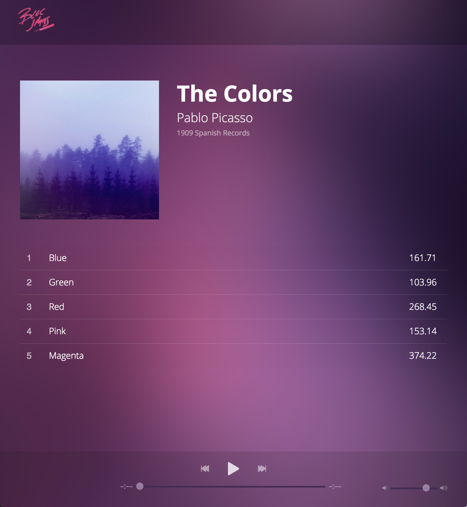

# bloc-jams-jquery
A starter project for Bloc's jQuery-driven music player app

As part of the Bloc Apprenticeship, I was tasked with rendering aspects of the UI as well as using jQuery to add functionality to a music player app called Bloc Jams. 

The objectives here were to:
1. Analyze the code base
2. Understand how to insert data in JS objects into DOM elements
3. Learn to use jQuery methods

All controls on the finished app, such as the play buttons and volume/time sliders, have functionality.

Please see a screenshort of the finished app, below:

